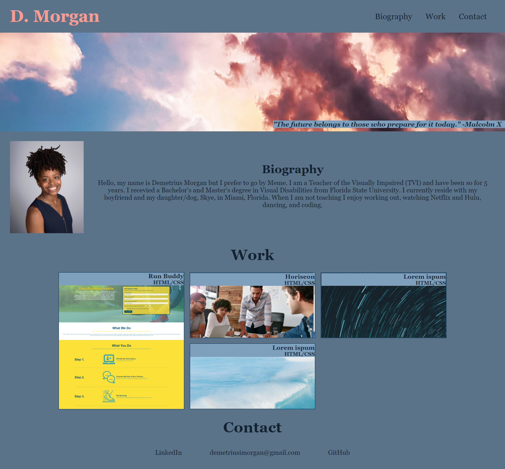

# Personal Portfolio

## Description
This is my Weekly Challenge #2 for my Coding Boot Camp class. Requirements included a photo, About Me section, Work section, and Contact Info. Certain links were to be made clickable such as those in the header navigation and images. When an image is clicked on, it leads to delpoyed applications. The portfolio must also be repsonsive and adaptable for different screen sizes.

[Live URL](https://dmorgan904.github.io/who-are-you/)

### Installation
1. Created title and HTML outline.
2. Added header and styled header.
3. Added and styled hero and Biography.
4. Added more changes to the HTML outline and fixed some style errors.
5. Created my CSS Grid for my Work section and styled it.
6. Turned text into clickable links.
7. Fix 980px media queries as many pieces were not responding properly.
8. Rework CSS grid to flow better with page.
9. Make more changes to media queries so everything would align properly.
10. Align Contact information better.

### Usage
This personal portfolio will be used to display my work so that potential employers will be able to see what I am capable of. Over time, more of my work will be added.

  

## Credits
Here are the following tutorials that I used while making this portfolio:

- [Inspect CCS Grid](https://developers.google.com/web/tools/chrome-devtools/css/grid)

